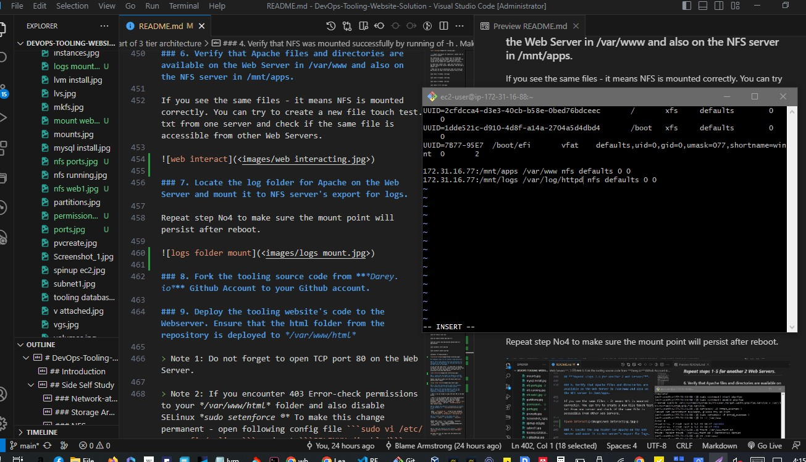

# DevOps-Tooling-Website-Solution - Armstrong

## Introduction

In this Project I will implement a set of DevOps tools that will help a DevOps team in day to day activities in managing, developing, testing, deploying and monitoring different projects.

These tools are well known and widely used by multiple DevOps teams. This single DevOps Tooling Solution will consist of:

1. **Jenkins** - free and open source automation server used to build **CI/CD** pipelines.
2. **Kubernetes** - an open-source container-orchestration system for automating computer application deployment, scaling,  and management.
3. **Jfrog Artifactory** - Universal Repository Manager supporting all major packaging formats, build tools and Cl servers. Artifactory.
4. **Rancher** - an open source software platform that enables organizations to run and manage **Docker** and Kubernetes in production.
5. **Grafana** - a multi-platform open source analytics and interactive visualization web application.
6. **Prometheus** - An open-source monitoring system with a dimensional data model, flexible query language, efficient time series database and modern alerting approach.
7. **Kibana** - Kibana is a free and open user interface that lets you visualize your **Elasticsearch** data and navigate the **Elastic Stack**.


## Side Self Study

### Network-attached storage (NAS)

Network-attached storage (NAS) is a file-level (as opposed to block-level storage) computer data storage server connected to a computer network providing data access to a heterogeneous group of clients. 

The term "NAS" can refer to both the technology and systems involved, or a specialized device built for such functionality (as unlike tangentially related technologies such as local area networks, 
a NAS device is often a singular unit).

### Storage Area Network (SAN) 

A storage area network (SAN) or storage network is a computer network which provides access to consolidated, block-level data storage. 

SANs are primarily used to access data storage devices, such as disk arrays and tape libraries from servers so that the devices appear to the operating system as direct-attached storage. 

A SAN typically is a dedicated network of storage devices not accessible through the local area network (LAN).

### NFS

Network File System (NFS) is a distributed file system protocol originally developed by Sun Microsystems (Sun) in 1984, allowing a user on a client computer to access files over a computer network much like local storage is accessed. 
NFS, like many other protocols, builds on the Open Network Computing Remote Procedure Call (ONC RPC) system. 
NFS is an open IETF standard defined in a Request for Comments (RFC), allowing anyone to implement the protocol.

### FTP

The File Transfer Protocol (FTP) is a standard communication protocol used for the transfer of computer files from a server to a client on a computer network. 

FTP is built on a client–server model architecture using separate control and data connections between the client and the server.

FTP users may authenticate themselves with a plain-text sign-in protocol, normally in the form of a username and password, but can connect anonymously if the server is configured to allow it. 

For secure transmission that protects the username and password, and encrypts the content, FTP is often secured with SSL/TLS (FTPS) or replaced with SSH File Transfer Protocol (SFTP).

### SMB

Server Message Block (SMB) is a communication protocol mainly used by Microsoft Windows equipped computers normally used to share files, printers, serial ports, and miscellaneous communications between nodes on a network. 

SMB implementation consists of two vaguely named Windows services: "Server" (ID: LanmanServer) and "Workstation" (ID: LanmanWorkstation).

It uses NTLM or Kerberos protocols for user authentication. 
It also provides an authenticated inter-process communication (IPC) mechanism.

### iSCSI

Internet Small Computer Systems Interface or iSCSI is an Internet Protocol-based storage networking standard for linking data storage facilities. 

iSCSI provides block-level access to storage devices by carrying SCSI commands over a TCP/IP network. 
iSCSI facilitates data transfers over intranets and to manage storage over long distances. 

It can be used to transmit data over local area networks (LANs), wide area networks (WANs), or the Internet and can enable location-independent data storage and retrieval.

### Block-level storage is and how it is used by Cloud Service providers

Block-level storage is a concept in cloud-hosted data persistence where cloud services emulate the behaviour of a traditional block device, such as a physical hard drive.

Developers use block storage to store containerized applications on the cloud. Containers are software packages that contain the application and its resource files for deployment in any computing environment. Like containers, block storage is equally flexible, scalable, and efficient.

Storage in such services is organised as blocks. 
This emulates the type of behaviour seen in traditional disks or tape storage through storage virtualization. 

Blocks are identified by an arbitrary and assigned identifier by which they may be stored and retrieved, but this has no obvious meaning in terms of files or documents. 

A file system must be applied on top of the block-level storage to map 'files' onto a sequence of blocks.
Amazon EBS (elastic block store) is an example of a cloud block store.

### Difference between Block-level storage and Object storage 

Object storage normally uses a distributed storage environment across multiple different storage nodes or servers. 

On the other hand, block storage uses RAID, SSDs, and hard disk drives (HDDs) for storage. 

Finally, cloud file storage uses network-attached storage (NAS) in an on-premises setup.

### AWS services

Amazon Web Services (AWS) is the world's most comprehensive and broadly adopted cloud, offering over 200 fully featured services from data centers globally.

### Difference between Block Storage, Object Storage and Network File System.

Object storage normally uses a distributed storage environment across multiple different storage nodes or servers. 

On the other hand, block storage uses RAID, SSDs, and hard disk drives (HDDs) for storage. 

Finally, cloud file storage uses network-attached storage (NAS) in an on-premises setup.

## Project Objective

> In this project I will implement a tooling website solution which makes access to DevOps tools within the corporate infrastructure easily accessible.

In this project I will implement a solution that consists of following components:
1. Infrastructure: AWS
2. Webserver Linux: Red Hat Enterprise Linux 8
3. Database Server: Ubuntu 20.04+ MySQL
4. Storage Server: Red Hat Enterprise Linux 8 + NFS Server
5. Programming Language: PHP
6. Code Repository: GitHub

> The diagram below shows a common pattern where several stateless Web Servers share a common database and also access the same files using Network File Sytem (NFS) as a shared file storage. 


> Even though the NFS server might be located on a completely separate hardware.

> For Web Servers it look like a local file system from where they can serve the same files.

It is important to know what storage solution is suitable for what use cases, for this - you need to answer following questions: 

> what data will be stored

> in what format

> how this data will be accessed

> by whom, from where

> how frequently

> etc. 

> Base on this you will be able to choose the right storage system for your solution.

***For Rhel 8 server use this ami***
```
RHEL-8.6.0_HVM-20220503-x86_64-2-Hourly2-GP2 (ami-035c5dc086849b5de)
```

## Implementing a business website using NFS for the backend file storage

### Step 1 - Prepare NFS Server

> 1. Spin up a new EC2 instance with RHEL Linux 8 Operating System.


> 2. Based on your LVM experience from Project 6, Configure LVM on the Server.


• Instead of formating the disks as ext4 you will have to format them as xfs
• Ensure there are 3 Logical Volumes. 1v-opt lv-apps, and lv-logs


```
sudo mkfs -t xfs /dev/webdata-vg/lv-opt
```
```
sudo mkfs -t xfs /dev/webdata-vg/lv-apps
```
```
sudo mkfs -t xfs /dev/webdata-vg/lv-logs
```


> 3. Create mount points on /mnt directory for the logical volumes as follow: 

```
sudo mkdir /mnt/apps
```
```
sudo mkdir /mnt/logs
```
```
sudo mkdir /mnt/opt
```

Mount lv-apps on /mnt/apps

- To be used by webservers 

Mount lv-logs on /mnt/logs

- To be used by webserver logs 

Mount Iv-opt on /mnt/opt 

- To be used by Jenkins server in Project 8


```
sudo mount /dev/webdata-vg/lv-apps /mnt/apps
```
```
sudo mount /dev/webdata-vg/lv-logs /mnt/logs
```
```
sudo mount /dev/webdata-vg/lv-opt /mnt/opt
```


> 4. Install NFS server, configure it to start on reboot and make sure it is u and running.

```
sudo yum -y update
```
```
sudo yum install nfs-utils -y
```
```
sudo systemctl start nfs-server.service
```
```
sudo systemctl enable nfs-server.service
```
```
sudo systemctl status nfs-server.service
```


> 5. Export the mounts for webservers' subnet cidr to connect as clients. 

For simplicity, I will install your all three Web Servers inside the same subnet, but in production set up you would probably want to separate each tier inside its own subnet for higher level of security. 

To check your subnet cidr - open your EC2 details in AWS web console and locate 'Networking' tab and open a Subnet link:

> Make sure we set up permission that will allow our Web servers to read, write and execute files on NFS:

```
sudo chown -R nobody: /mnt/apps
```
```
sudo chown -R nobody: /mnt/logs
```
```
sudo chown -R nobody: /mnt/opt
```
```
sudo chmod -R 777 /mnt/apps
```
```
sudo chmod -R 777 /mnt/logs
```
```
sudo chmod -R 777 /mnt/opt
```
```
sudo systemctl restart nfs-server.service
```


> Configure access to NFS for clients within the same subnet (example of Subnet CIDR 172.31.32.0/20 ):

```
sudo vi /etc/exports
```
```
/mnt/apps <Subnet-CIDR>(rw,sync,no_all_squash,no_root_squash)
/mnt/logs <Subnet-CIDR>(rw,sync,no_all_squash,no_root_squash)
/mnt/opt <Subnet-CIDR>(rw,sync,no_all_squash,no_root_squash)
```

```
/mnt/apps 172.31.16.0/20(rw,sync,no_all_squash,no_root_squash)
/mnt/logs 172.31.16.0/20(rw,sync,no_all_squash,no_root_squash)
/mnt/opt 172.31.16.0/20(rw,sync,no_all_squash,no_root_squash)
```

```
Esc + :wq!
```


```
sudo exportfs -arv
```


> 6. Check which port is used by NFS and open it using Security Groups (add new Inbound Rule)

```
rpcinfo -p | grep nfs
```


Important note: In order for NFS server to be accessible from your client, you must also open following ports: TCP 111, UDP 111, UDP 2049


## Configure backend database as part of 3 tier architecture

### Step 2 - Configure the database server

By now you should know how to install and configure a MySQL DBMS to work with remote Web Server

1. Install MySQL server
2. Create a database and name it *tooling*
3. Create a database user and name it *webaccess*
4. Grant permission to *webaccess* user on *tooling* database to do anything only from the webservers *subnet cidr*

```
sudo apt update
```
```
sudo apt install mysql-server -y
```
```
sudo mysql
```

```
create database tooling;
create user 'webaccess'@'172.31.16.0/20' identified by 'password';
grant all privileges on tolling.* to 'webaccess'@'172.31.16.0/20';
flush privileges;
show databases;
exit;
```


```
sudo vi /etc/mysql/mysql.conf.d/mysqld.cnf
```


```
sudo systemctl restart mysql
```

```
sudo systemctl status mysql
```


### Step 3 Prepare the Web Servers

We need to make sure that our Web Servers can serve the same content from shared storage solutions, in our case - NFS Server and MySQL database. You already know that one DB can be accessed for *reads* and *writes* by multiple clients. 

For storing shared files that our Web Servers will use 
we will utilize NFS and mount previously created Logical Volume *Iv-apps* to the folder where Apache stores files to be served to the users *(/var/www )*.

This approach will make our Web Servers stateless, which means we will be able to add new ones or remove them whenever we need, and the integrity of the data (in the database and on NFS) will be preserved.

During the next steps we will do following:

• Configure NFS client (this step must be done on all three servers)

• Deploy a Tooling application to our Web Servers into a shared NFS folder

• Configure the Web Servers to work with a single MySQL database


### 1. Launch a new EC2 instance with RHEL 8 Operating System


### 2. Install NFS client

```
sudo yum install nfs-utils nfs4-acl-tools -y
```


### 3. Mount /var/www/ and target the NFS server's export for apps

```
sudo mkdir /var/www
```
```
sudo mount -t nfs -o rw,nosuid <NFS-Server-Private-IP-Address>:/mnt/apps /var/www
```
```
sudo mount -t nfs -o rw,nosuid 172.31.16.77:/mnt/apps /var/www
```


### 4. Verify that NFS was mounted successfully by running of -h . Make sure that the changes will persist on Web Server after reboot:

```
sudo vi /etc/fstab
```

add following line

```
<NFS-Server-Private-IP-Address>:/mnt/apps /var/www nfs defaults 0 0
```
```
172.31.16.77:/mnt/apps /var/www nfs defaults 0 0
```


### 5. Install *Remi's repository*, Apache and PHP

```
sudo yum install httpd -y
```


```
sudo dnf install https://dl.fedoraproject.org/pub/epel/epel-release-latest-8.noarch.rpm
```
```
sudo dnf install dnf-utils http://rpms.remirepo.net/enterprise/remi-release-8.rpm
```
```
sudo dnf module reset php
```
```
sudo dnf module enable php:remi-7.4
```
```
sudo dnf install php php-opcache php-gd php-curl php-mysqlnd
```
```
sudo systemctl start php-fpm
```
```
sudo systemctl enable php-fpm
```
```
setsebool -P httpd_execmem 1
```


## ***Repeat steps 1-5 for another 2 Web Servers***.

### 6. Verify that Apache files and directories are available on the Web Server in /var/www and also on the NFS server in /mnt/apps. 

If you see the same files - it means NFS is mounted correctly. You can try to create a new file touch test.txt from one server and check if the same file is accessible from other Web Servers.


### 7. Locate the log folder for Apache on the Web Server and mount it to NFS server's export for logs. 

Repeat step No4 to make sure the mount point will persist after reboot.




### 8. Fork the tooling source code from ***Darey.io*** Github Account to your Github account. 

```
sudo yum install git
```
```
git clone https://github.com/darey-io/tooling.git
```


### 9. Deploy the tooling website's code to the Webserver. Ensure that the html folder from the repository is deployed to */var/www/html*

```
sudo cp -R html/. /var/www/html
```
```
ls /var/www/html
```


> Note 1: Do not forget to open TCP port 80 on the Web Server.


> Note 2: If you encounter 403 Error-check permissions to your */var/www/html* folder and also disable SELinux *sudo setenforce ®* 

To make this change permanent - open following config file 

```
sudo setenforce 0
```

```
sudo vi /etc/sysconfig/selinux
``` 

and set 

```
SELINUX-disabled
```


then restart httpd.


> change binding address to 0.0.0.0

```
sudo vi /etc/mysql/mysql.conf.d/mysqld.cnf
```


### 10. Update the website's configuration to connect to the database (in ```/var/www/html/functions.php``` file).

```
sudo vi /var/www/html/functions.php
```


 Apply ```tooling-db.sql``` script to your database using this command ```mysql -h <databse-private-ip> -u <db-username> -p <db-pasword> < tooling-db.sql```

```
sudo yum install mysql
```

 ```
 tooling-db.sql
 ```
 ```
 mysql -h <databse-private-ip> -u <db-username> -p <db-pasword> < tooling-db.sql
 ```
 ```
 mysql -h 172.31.31.166 -u webaccess -p tooling < tooling-db.sql
 ```


> encountered MySQL Error 1045 : https://kinsta.com/knowledgebase/mysql-error-1045/#:~:text=Fortunately%2C%20there%20are%20ways%20you,listening%20to%20the%20right%20port.

### 11. Create in MySQL a new admin user with username: ```myuser``` and password: ```password:```

```
INSERT INTO 'users' ('id', 'username', 'password', 'email', 'user_type', 'status') VALUES
-> (1, 'myuser', '5f4dcc3b5aa765d61d8327deb882cf99', 'user@mail.com', 'admin', '1');
```

### 12. Open the website in your browser 

```
http://<Web-Server-Public-IP-Address-or-Public-DNS-Name>/index.php
``` 

```
http://18.153.68.12/index.php
```

and make sure you can login into the website with ```myuser``` user.

> the expected outcome is as shown below


### We have just implemented a web solution for a DevOps team using LAMP stack with remote Database and NFS servers.

# Congratulations!


